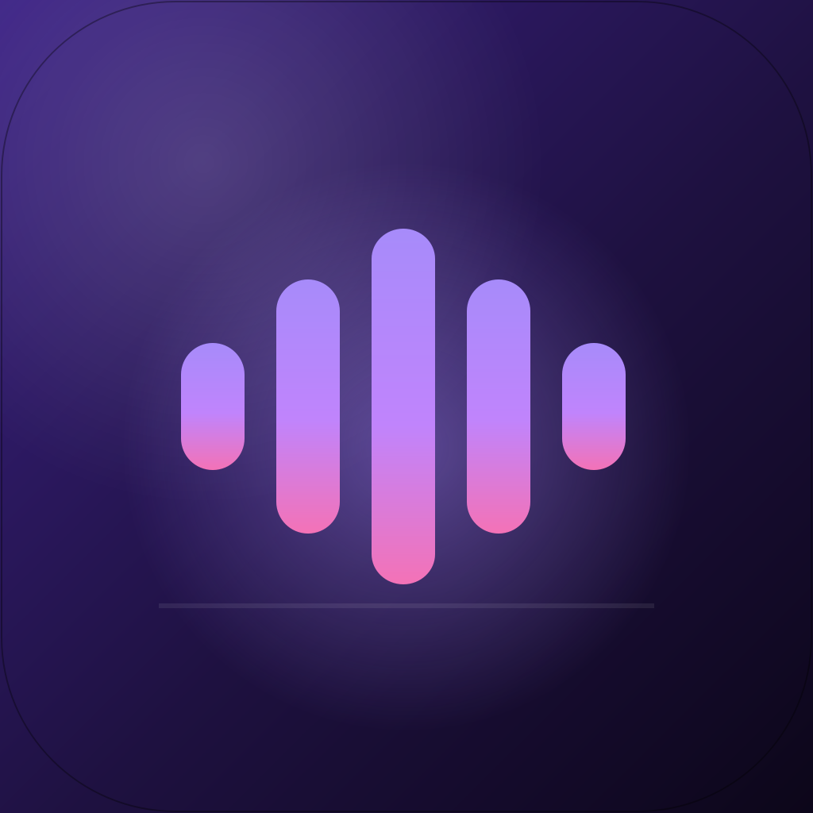

<div align="center">

<h1>Sunnify (Spotify Downloader)</h1>

<a href="https://github.com/sunnypatell/sunnify-spotify-downloader/stargazers"></a>
<a href="https://github.com/sunnypatell/sunnify-spotify-downloader/issues"></a>
<a href="https://github.com/sunnypatell/sunnify-spotify-downloader/pulls"></a>
<a href="LICENSE"></a>

<br/>



<p><em>🎧 Download entire Spotify playlists to local MP3s with embedded artwork and tags. Desktop app, Python core, and a full web stack in one repo.</em></p>

</div>

> [!CAUTION]
> **⚠️ EDUCATIONAL PROJECT DISCLAIMER**
>
> This software was developed as a **student portfolio project** for educational purposes only. It is intended to demonstrate software engineering skills including API integration, multi-threading, cross-platform development, and full-stack architecture.
>
> **By using this software, you acknowledge that:**
> - You will only use it in jurisdictions where downloading copyrighted content for personal use is permitted
> - You are responsible for complying with all applicable laws in your region
> - This tool should only be used with content you own or have explicit permission to download
> - The developer assumes no liability for misuse of this software
>
> **See [full disclaimer](#legal-disclaimer) below and read [DISCLAIMER.md](DISCLAIMER.md) for complete legal terms.**

<p align="center">
    <a href="#table-of-contents">Jump to Table of Contents</a>
</p>

<hr/>

## Table of Contents

1. Overview
2. Architecture
3. Features
4. Requirements
5. Quick Start (3 Paths)
6. Desktop App Setup (Windows and cross-platform)
7. Web App Setup (Backend and Frontend)
8. Configuration
9. Usage Guide
10. Diagnostics
11. Troubleshooting
12. Notes and Roadmap
13. **⚖️ Legal Disclaimer**
14. Contributing and Community
15. Author

<hr/>

## Overview

Sunnify is built to be resilient, fast, and simple:

- Uses Spotify's embed page API to fetch playlist/track metadata without credentials.
- Downloads audio via YouTube search using `yt-dlp` with FFmpeg.
- Writes clean ID3 tags and embeds cover art for your library.
- Ships as a PyQt desktop app, a Flask API, and a modern Next.js web client.
- Supports both individual track and full playlist downloads (v2.0.0+).

Screenshots from the desktop app in action:

 

<hr/>

## Architecture

```
root
├─ Spotify_Downloader.py          (PyQt5 desktop app)
├─ spotifydown_api.py             (Spotify embed page API client)
├─ Template.py / Template.ui      (Generated UI for the desktop app)
├─ scripts/
│  └─ check_api_status.py         (Diagnostics for embed API and yt-dlp)
├─ dist/
│  └─ Sunnify (Spotify Downloader).exe   (Prebuilt Windows executable)
├─ web-app/
│  ├─ sunnify-backend/            (Flask API: SSE + JSON responses)
│  │  ├─ app.py                   (/api/scrape-playlist, /api/download)
│  │  ├─ requirements.txt         (Backend dependencies)
│  │  └─ Procfile                 (gunicorn entry)
│  └─ sunnify-webclient/          (Next.js 14 + Tailwind + shadcn/ui)
│     ├─ app/page.tsx             (Renders <SunnifyApp />)
│     └─ components/sunnify-app.tsx  (Main UI + API integration)
├─ req.txt                        (Desktop app Python deps)
├─ Sunnify (Spotify Downloader).spec  (PyInstaller build spec)
└─ README.md
```

<hr/>

## Features

- 🎼 Full playlist and single track downloader (tagged MP3 library)
- 🖼️ Artwork and tagging (title, artists, album, release date, cover art)
- 🚦 Spotify embed page API (no credentials required)
- 🎯 YouTube audio via `yt-dlp` with FFmpeg conversion
- 🪟 Clean desktop UI (progress, preview panel, settings, download location picker)
- 🌐 Web experience (Flask backend and Next.js client)

<hr/>

## Requirements

**Pre-built apps**: No dependencies required. FFmpeg is bundled.

**Building from source**:
- Python 3.8 or newer
- FFmpeg on PATH (for MP3 conversion)
- Node.js 18+ (for web client only)
- Internet access to `open.spotify.com` and YouTube

<details>
<summary>Install FFmpeg for building from source</summary>

Windows:
```powershell
winget install Gyan.FFmpeg
```

macOS:
```bash
brew install ffmpeg
```

Linux:
```bash
sudo apt install -y ffmpeg
```

</details>

<hr/>

## Quick Start (3 Paths)

### Download Pre-built Apps

| Platform | Download | Notes |
|----------|----------|-------|
| **Windows** | [Sunnify.exe](https://github.com/sunnypatell/sunnify-spotify-downloader/releases/latest) | Run directly, no install needed |
| **macOS** | [Sunnify.app](https://github.com/sunnypatell/sunnify-spotify-downloader/releases/latest) | See macOS notes below |
| **Linux** | [Sunnify](https://github.com/sunnypatell/sunnify-spotify-downloader/releases/latest) | Make executable: `chmod +x Sunnify` |

<details>
<summary><strong>macOS: Unsigned app instructions</strong></summary>

The macOS app is not notarized. After downloading and extracting:

```bash
# Remove quarantine attribute (required for unsigned apps)
sudo xattr -cr /Applications/Sunnify.app

# Or if you extracted elsewhere:
sudo xattr -cr ~/Downloads/Sunnify.app
```

If you see "app is damaged" or "unidentified developer":
1. Open System Preferences → Security & Privacy → General
2. Click "Open Anyway" next to the Sunnify message
3. Or run the `xattr` command above

</details>

### Other Install Methods

- **Python users**: `pip install -r req.txt` then `python Spotify_Downloader.py`
- **Homebrew (macOS)**:
  ```bash
  brew tap sunnypatell/sunnify https://github.com/sunnypatell/sunnify-spotify-downloader
  brew install --cask sunnify
  ```
- **Web stack**: run the Flask backend and Next.js client under `web-app/`

<hr/>

## Desktop App Setup (Windows and cross-platform)

Windows PowerShell commands:

```powershell
# Clone
git clone https://github.com/sunnypatell/sunnify-spotify-downloader.git
cd sunnify-spotify-downloader

# Create and activate a venv (recommended)
py -3 -m venv .venv; .\.venv\Scripts\Activate.ps1

# Install dependencies
pip install -r req.txt

# Ensure FFmpeg is on PATH
ffmpeg -version

# Launch the PyQt app
python .\Spotify_Downloader.py
```

macOS/Linux equivalent:

```bash
git clone https://github.com/sunnypatell/sunnify-spotify-downloader.git
cd sunnify-spotify-downloader
python3 -m venv .venv && source .venv/bin/activate
pip install -r req.txt
ffmpeg -version
python Spotify_Downloader.py
```

Build a Windows EXE with PyInstaller:

```powershell
.\.venv\Scripts\Activate.ps1
pyinstaller "Sunnify (Spotify Downloader).spec"
```

Output files are placed in `dist/`.

<hr/>

## Web App Setup (Backend and Frontend)

### Backend (Flask)

```powershell
cd web-app\sunnify-backend
py -3 -m venv .venv; .\.venv\Scripts\Activate.ps1
pip install -r requirements.txt
python .\app.py
# Serves on http://127.0.0.1:5000
```

Endpoints:

- `POST /api/scrape-playlist` processes a playlist and emits progress or completion events.
- `GET /api/download/<filename>?path=<dir>` serves a file from a directory.

The local server can stream Server-Sent Events (SSE). Each event looks like:
`{"event":"progress"|"complete"|"error","data":{...}}`.

Production style run with gunicorn:

```powershell
pip install gunicorn
gunicorn app:app --bind 0.0.0.0:5000
```

### Frontend (Next.js)

```powershell
cd ..\sunnify-webclient
npm install
npm run dev
# Opens http://localhost:3000
```

Configure API base in `.env.local` (recommended):

```dotenv
NEXT_PUBLIC_API_BASE=http://127.0.0.1:5000
```

Then update `components/sunnify-app.tsx` to use `process.env.NEXT_PUBLIC_API_BASE + '/api/scrape-playlist'`.

Local production simulation:

```powershell
npm run build
npm start
```

Note: the web client points to a Render-hosted backend by default. The free tier spins down after inactivity, so the first request may take up to 50 seconds. For local development, update the API URL in `components/sunnify-app.tsx`.

<hr/>

## Configuration

- `NEXT_PUBLIC_API_BASE` base URL for the webclient backend (set via `.env.local`)
- Desktop app download location: click the ⚙ (settings) button to change

<details>
<summary>Advanced configuration tips</summary>

- Corporate networks may block `open.spotify.com`. Allowlist this domain.
- Increase request timeouts only if your network is unusually slow. See `spotifydown_api.py` for defaults.
- Ensure download paths have write permissions.

</details>

<hr/>

## Usage Guide

Desktop app (GUI):

1. Launch Sunnify.
2. Paste a Spotify URL:
   - Playlist: `https://open.spotify.com/playlist/<ID>`
   - Single track: `https://open.spotify.com/track/<ID>`
3. Click the green **Download** button (or press Enter) to start.
4. Optional: click ⚙ to change download location.
5. Optional: enable **Show Preview** to see the cover and meta.
6. Optional: enable **Add Meta Tags** to embed ID3 and artwork.
7. Output appears in your chosen download folder (default: `music/`).

Web client:

1. Start Flask backend and Next.js client.
2. Open `http://localhost:3000`.
3. Enter playlist URL and a writable download path.
4. Click Process Playlist and watch progress.

<hr/>

## Deep Dive: How It Works

### Provider Strategy (spotifydown_api.py)

- `SpotifyEmbedAPI` fetches playlist/track data from Spotify's embed pages (`/embed/playlist/{id}`, `/embed/track/{id}`).
- Extracts `__NEXT_DATA__` JSON blob containing full track metadata without authentication.
- For playlists >100 tracks, uses spclient API with anonymous tokens from embed pages.
- `PlaylistClient` is a high-level wrapper providing simple methods for common operations.

### Download Pipeline (Desktop App)

For each track:

1. Fetch metadata from Spotify embed page.
2. Search YouTube: `ytsearch1:<title> <artists> audio`.
3. Download and convert to MP3 (`yt-dlp` plus FFmpeg).
4. Write ID3 tags (Mutagen) with title, artist, album, date.
5. Embed cover art (from track or playlist metadata).

### Web Backend (web-app/sunnify-backend/app.py)

- `POST /api/scrape-playlist` can stream JSON events (SSE) while processing.
- Completion event includes `playlistName` and `tracks` with download links.

<hr/>

## Diagnostics

Validate Spotify embed API and `yt-dlp` from your network:

```powershell
python .\scripts\check_api_status.py
```

Example output shows embed API status, large playlist fallback, and YouTube search results. See [API_STATUS.md](API_STATUS.md) for details.

<hr/>

## Troubleshooting

- **FFmpeg not found**: install FFmpeg and restart terminal so PATH updates.
- **yt-dlp errors**: `pip install -U yt-dlp` and ensure YouTube is reachable.
- **URL rejected**: format must be `https://open.spotify.com/playlist/<ID>` or `https://open.spotify.com/track/<ID>`.
- **Embed API fails**: check if `open.spotify.com` is accessible from your network.
- **Hosted backend cold starts**: free tiers can sleep; first call might take seconds.
- **Permission errors**: choose a download path you have write access to.
- **macOS "app is damaged"**: run `sudo xattr -cr /path/to/Sunnify.app` to remove quarantine.
- **macOS "unidentified developer"**: open System Preferences → Security & Privacy → click "Open Anyway".

<hr/>

## Notes and Roadmap

Important note (hosted backends): on free compute plans, the backend might sleep and take a moment to wake on the first request.

Coming soon:

- Apple Music and iTunes import
- Android MTP copy support
- Webclient SSE progress UI

<hr/>

<a name="legal-disclaimer"></a>
## ⚖️ Legal Disclaimer

### ⚠️ THIS IS A STUDENT PORTFOLIO PROJECT - NOT A PIRACY TOOL

> **IMPORTANT**: This software was developed solely as an educational demonstration of software engineering concepts. It exists to showcase technical skills for academic and portfolio purposes. **The developer does not condone, encourage, or support any form of copyright infringement or piracy.**

### Educational Purpose Statement

**Sunnify was created as a student portfolio project** to demonstrate proficiency in:
- Full-stack software development (Python, Flask, Next.js, PyQt5)
- API design and reverse engineering
- Multi-threaded application architecture
- Cross-platform desktop application development
- CI/CD pipelines and automated testing

This project is provided **free of charge** as an open-source educational resource. It is not intended for commercial use or to facilitate copyright infringement.

### Terms of Use

By downloading, installing, or using this software, you agree to the following:

1. **Personal Use Only**: This software is intended for downloading content you already own, have purchased, or have explicit permission to download. Downloading copyrighted material without authorization may violate laws in your jurisdiction.

2. **Jurisdictional Compliance**: You are solely responsible for determining whether your use of this software complies with applicable laws in your country, state, or region. Some jurisdictions permit downloading copyrighted content for personal/backup purposes; others do not.

3. **No Warranty**: This software is provided "as is" without warranty of any kind, express or implied. The developer makes no guarantees regarding functionality, reliability, or fitness for any particular purpose.

4. **Limitation of Liability**: The developer shall not be held liable for any damages, legal consequences, or other liabilities arising from the use or misuse of this software. Users assume all risks associated with its use.

5. **No Endorsement of Piracy**: This project does not endorse, encourage, or facilitate piracy or copyright infringement. It is designed as a technical demonstration and should be used responsibly and legally.

### Fair Use & Research

This project may be used for:
- ✅ Downloading music you have purchased elsewhere for format-shifting
- ✅ Creating personal backups of content you own
- ✅ Educational research into API design and audio processing
- ✅ Learning software development techniques
- ❌ **NOT** for distributing copyrighted content
- ❌ **NOT** for commercial purposes
- ❌ **NOT** in jurisdictions where such downloads are prohibited

### Acknowledgment of Responsibility

By downloading, installing, or using this software, you acknowledge that:

1. **You alone are responsible** for how you use this software
2. **You will comply** with all applicable laws in your jurisdiction
3. **You understand** that unauthorized downloading of copyrighted content may be illegal
4. **You accept** that the developer bears no responsibility for your actions
5. **You have read** and agree to the full terms in [DISCLAIMER.md](DISCLAIMER.md)

### DMCA & Takedown Requests

If you are a rights holder and believe this project infringes on your intellectual property, please contact `sunnypatel124555@gmail.com` with details, and I will respond promptly. **This project will comply with all valid takedown requests.**

### Security

See [SECURITY.md](SECURITY.md) for reporting security vulnerabilities and [LICENSE](LICENSE) for license terms.

### Final Note

**If you are looking for a tool to pirate music, this is not it.** This project exists purely as a technical demonstration. The developer strongly encourages supporting artists by purchasing music through legitimate channels or using authorized streaming services. **Use this software responsibly and legally, or do not use it at all.**

<hr/>

## Contributing and Community

Contributions, ideas, and bug reports are welcome.

- Read the [CODE_OF_CONDUCT](CODE_OF_CONDUCT.md) and [CONTRIBUTING](CONTRIBUTING.md)
- Open issues with clear repro steps and logs where possible
- Prefer small, focused PRs

<hr/>

## Author

Created and maintained by Sunny Jayendra Patel. Reach me at `sunnypatel124555@gmail.com` or connect on LinkedIn.

</div>
