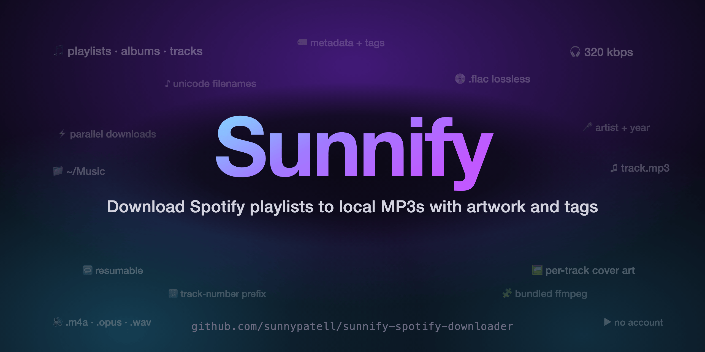

<div align="center">



<h1>Sunnify &middot; Spotify Playlist Downloader</h1>

<p><strong>Download Spotify playlists, albums, and tracks to local MP3s with embedded artwork and tags.</strong><br/>
Free, open source, cross-platform desktop app. No account, no subscription, no command line.</p>

<a href="https://github.com/sunnypatell/sunnify-spotify-downloader/releases/latest"></a>
<a href="https://github.com/sunnypatell/sunnify-spotify-downloader/releases"></a>
<a href="https://github.com/sunnypatell/sunnify-spotify-downloader/stargazers"></a>

<a href="https://github.com/sunnypatell/sunnify-spotify-downloader/actions/workflows/tests.yml"></a>
<a href="LICENSE"></a>

<br/><br/>

<strong><a href="#download">Download</a> &nbsp;&middot;&nbsp; <a href="#features">Features</a> &nbsp;&middot;&nbsp; <a href="#how-to-use">How to use</a> &nbsp;&middot;&nbsp; <a href="#build-from-source">Build from source</a> &nbsp;&middot;&nbsp; <a href="#legal-disclaimer">Disclaimer</a></strong>

</div>

> [!CAUTION]
> **Educational / student portfolio project.** Sunnify is a technical demonstration, not a piracy tool. Use it only for content you own or are permitted to download, and only where doing so is legal in your jurisdiction. See the [full legal disclaimer](#legal-disclaimer) and [DISCLAIMER.md](DISCLAIMER.md).

---

## What is Sunnify?

**Sunnify is a free, open-source Spotify playlist downloader for macOS, Windows, and Linux.** Paste any Spotify playlist, album, or track link and Sunnify saves it as local audio files (MP3, M4A, FLAC, Opus, or WAV) with the cover art, title, artist, album, year, and track number written straight into the file's tags. No Spotify account, no API keys, no command line, no separate FFmpeg install.

It is a desktop GUI built with Python and PyQt5. Metadata is read from Spotify's public pages and audio is sourced and transcoded locally, so everything runs on your own machine.

<div align="center">

</div>

---

## Download

| Platform | Get it | Notes |
| :--- | :--- | :--- |
| **macOS** | [`Sunnify-macOS.zip`](https://github.com/sunnypatell/sunnify-spotify-downloader/releases/latest) or Homebrew (below) | Apple Silicon + Intel |
| **Windows** | [`Sunnify-Windows.exe`](https://github.com/sunnypatell/sunnify-spotify-downloader/releases/latest) | Run directly, no install |
| **Linux** | [`Sunnify-Linux`](https://github.com/sunnypatell/sunnify-spotify-downloader/releases/latest) | `chmod +x Sunnify-Linux` then run |

FFmpeg is bundled inside every prebuilt app, so there is nothing else to install.

### Homebrew (macOS)

```bash
brew tap sunnypatell/sunnify https://github.com/sunnypatell/sunnify-spotify-downloader
brew install --cask sunnify
```

The cask verifies the download's checksum and clears macOS quarantine for you, so the app opens normally on first launch.

<details>
<summary><strong>macOS: opening the app from a direct download</strong></summary>

The app is ad-hoc signed but not notarized (notarization needs a paid Apple Developer account; this is an unfunded student project). The Homebrew install above is friction-free. For a direct `.zip` download from the Releases page, remove the quarantine flag once:

```bash
xattr -r -d com.apple.quarantine /Applications/Sunnify.app
```

Or use Gatekeeper's flow: double-click once, then **System Settings → Privacy & Security → Open Anyway** (macOS Sequoia and later removed the old right-click-Open shortcut).

</details>

---

## Features

- **Playlists, albums, and single tracks.** Paste a normal link, an `intl-xx` locale link, or a `spotify:` URI copied from the desktop app. Each playlist or album downloads into its own folder.
- **Five audio formats.** MP3, M4A, Opus (lossy at 128 / 192 / 256 / 320 kbps) and FLAC / WAV (lossless). Your choice is remembered between sessions.
- **Real metadata, written correctly.** Title, artist(s), album, year, and track number are embedded for every format, with the front cover art baked in. MP3 tags are written for maximum player compatibility, so artwork and tags show up everywhere, including older car head-units, stock Android, and Windows Media Player.
- **Per-track cover art.** Each song gets its own artwork, not one shared playlist cover.
- **Parallel downloads.** Multiple songs download at once, so a playlist finishes much faster, with a cooperative Stop that takes effect immediately.
- **Resume large playlists.** A per-folder manifest records what already landed, so a playlist throttled by rate limits finishes across multiple sessions instead of starting over.
- **Optional track-number prefixes.** Turn on `01. Song - Artist.mp3` so the folder sorts in playlist order in any file manager.
- **Unicode-safe filenames.** Accented, CJK, and Cyrillic titles are preserved; only characters your filesystem actually rejects are stripped.
- **Accurate audio matching.** Sunnify matches on title, artist, and duration rather than grabbing the first search hit, so you get the real recording, not a remix or a sped-up edit.
- **Bundled FFmpeg, no account.** Everything needed ships inside the app, and nothing asks you to log in.

<div align="center">

</div>

---

## How to use

1. **Copy a Spotify link** for a playlist, album, or track (the Share menu, or copy the URL from your browser).
2. **Paste it** into Sunnify.
3. **Pick a format and quality** in Settings, and choose where files should go (defaults to your Music folder).
4. **Download.** Watch per-track progress; press Stop anytime.

Your downloads land in a folder named after the playlist or album, tagged and ready for any music library.

---

## Build from source

Requires **Python 3.9+**. FFmpeg must be available (bundled in the prebuilt apps; otherwise install via Homebrew, your package manager, or PATH).

```bash
git clone https://github.com/sunnypatell/sunnify-spotify-downloader.git
cd sunnify-spotify-downloader
pip install -r req.txt
python Spotify_Downloader.py
```

To produce a standalone app with [PyInstaller](https://pyinstaller.org/):

```bash
pip install pyinstaller
pyinstaller Sunnify.spec     # output in dist/
```

---

## Verify your download

Every release since 2.0.8 ships a verifiable supply-chain trail. Each binary carries **SLSA Build Level 3 provenance** binding it to the exact source commit and the isolated builder workflow, plus a CycloneDX SBOM and offline Sigstore bundles, all logged to the public Rekor transparency log.

```bash
# plain checksums, no extra tooling
sha256sum -c checksums.txt --ignore-missing

# cryptographic provenance (GitHub CLI)
gh attestation verify Sunnify-Linux --repo sunnypatell/sunnify-spotify-downloader
```

Full details and the threat model are in [SECURITY.md](SECURITY.md#release-integrity).

---

## How it works

Sunnify reads track metadata from Spotify's public embed pages (no authentication), finds the matching audio via a YouTube search through [yt-dlp](https://github.com/yt-dlp/yt-dlp), transcodes it to your chosen format with the bundled FFmpeg, and writes the tags and cover art with [Mutagen](https://mutagen.readthedocs.io/). It is a pure-Python core wrapped in a PyQt5 interface, packaged per-platform with PyInstaller.

---

<a name="legal-disclaimer"></a>
## Legal Disclaimer

### This is a student portfolio project, not a piracy tool

> **Sunnify was built solely as an educational demonstration of software engineering.** It exists to showcase technical skills for academic and portfolio purposes. The developer does not condone, encourage, or support copyright infringement or piracy.

It demonstrates desktop application development with Python and PyQt5, public-API integration and reverse engineering, multi-threaded architecture, and a hardened CI/CD release pipeline. It is provided free of charge as an open-source educational resource, not for commercial use.

### Terms of use

By downloading, installing, or using this software, you agree that:

1. **Personal use only.** Use it for content you own, have purchased, or have explicit permission to download. Downloading copyrighted material without authorization may violate the law where you live.
2. **You are responsible for compliance** with the laws of your country, state, or region. Some jurisdictions permit personal/backup downloads; others do not.
3. **No warranty.** The software is provided "as is," without warranty of any kind.
4. **Limitation of liability.** The developer is not liable for any damages or legal consequences arising from use or misuse. You assume all risk.
5. **No endorsement of piracy.** This is a technical demonstration and must be used responsibly and legally.

### Acceptable vs. not

- ✅ Format-shifting music you have purchased elsewhere
- ✅ Personal backups of content you own
- ✅ Research into API design and audio processing, and learning software development
- ❌ Distributing copyrighted content
- ❌ Commercial use
- ❌ Any use where such downloads are prohibited

### DMCA & takedown requests

If you are a rights holder and believe this project infringes your intellectual property, email `sunnypatel124555@gmail.com` with details and I will respond promptly. This project complies with all valid takedown requests.

> **If you are looking for a tool to pirate music, this is not it.** Please support artists by purchasing their music or using authorized streaming services. Use this software responsibly and legally, or do not use it at all.

See [DISCLAIMER.md](DISCLAIMER.md) for the complete legal terms.

---

## Contributing

Contributions, ideas, and bug reports are welcome.

- Read [CONTRIBUTING.md](CONTRIBUTING.md) and the [Code of Conduct](CODE_OF_CONDUCT.md)
- Open issues with clear repro steps and logs where possible
- Keep PRs small and focused
- Security reports: see [SECURITY.md](SECURITY.md)

---

## Author

Created and maintained by **Sunny Jayendra Patel**. Questions or feedback: `sunnypatel124555@gmail.com`.

Licensed under a custom educational-use license. See [LICENSE](LICENSE).

---

## Star History

<div align="center">

<a href="https://www.star-history.com/#sunnypatell/sunnify-spotify-downloader&Date">
  
</a>

</div>
